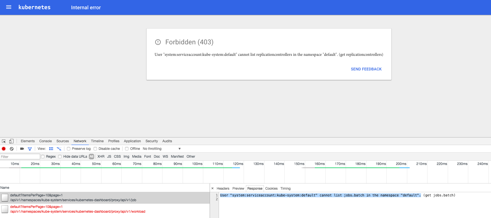

<!-- toc -->

tags: dashboard

# 部署 dashboard 插件

官方文件目录：`kubernetes/cluster/addons/dashboard`

使用的文件：

``` bash
$ ls *.yaml
dashboard-controller.yaml  dashboard-rbac.yaml  dashboard-service.yaml
```

+ 新加了 `dashboard-rbac.yaml` 文件，定义 dashboard 使用的 RoleBinding。

由于 `kube-apiserver` 启用了 `RBAC` 授权，而官方源码目录的 `dashboard-controller.yaml` 没有定义授权的 ServiceAccount，所以后续访问 `kube-apiserver` 的 API 时会被拒绝，前端界面提示：



解决办法是：定义一个名为 dashboard 的 ServiceAccount，然后将它和 Cluster Role view 绑定，具体参考 [dashboard-rbac.yaml文件](./manifests/dashboard/dashboard-rbac.yaml)。

已经修改好的 yaml 文件见：[dashboard](https://github.com/opsnull/follow-me-install-kubernetes-cluster/blob/master/manifests/dashboard)。

## 配置dashboard-service

``` bash
$ diff dashboard-service.yaml.orig dashboard-service.yaml
10a11
>   type: NodePort
```

+ 指定端口类型为 NodePort，这样外界可以通过地址 nodeIP:nodePort 访问 dashboard；

## 配置dashboard-controller

``` bash
20a21
>       serviceAccountName: dashboard
23c24
<         image: gcr.io/google_containers/kubernetes-dashboard-amd64:v1.6.0
---
>         image: cokabug/kubernetes-dashboard-amd64:v1.6.0
```

+ 使用名为 dashboard 的自定义 ServiceAccount；

## 执行所有定义文件

``` bash
$ pwd
/root/kubernetes/cluster/addons/dashboard
$ ls *.yaml
dashboard-controller.yaml  dashboard-rbac.yaml  dashboard-service.yaml
$ kubectl create -f  .
$
```

## 检查执行结果

查看分配的 NodePort

``` bash
$ kubectl get services kubernetes-dashboard -n kube-system
NAME                   CLUSTER-IP       EXTERNAL-IP   PORT(S)        AGE
kubernetes-dashboard   10.254.224.130   <nodes>       80:30312/TCP   25s
```

+ NodePort 30312映射到 dashboard pod 80端口；

检查 controller

``` bash
$ kubectl get deployment kubernetes-dashboard  -n kube-system
NAME                   DESIRED   CURRENT   UP-TO-DATE   AVAILABLE   AGE
kubernetes-dashboard   1         1         1            1           3m
$ kubectl get pods  -n kube-system | grep dashboard
kubernetes-dashboard-1339745653-pmn6z   1/1       Running   0          4m
```

## 访问dashboard

1. kubernetes-dashboard 服务暴露了 NodePort，可以使用 `http://NodeIP:nodePort` 地址访问 dashboard；
1. 通过 kube-apiserver 访问 dashboard；
1. 通过 kubectl proxy 访问 dashboard：

### 通过 kubectl proxy 访问 dashboard

启动代理

``` bash
$ kubectl proxy --address='172.27.132.65' --port=8086 --accept-hosts='^*$'
Starting to serve on 172.27.132.65:8086
```

+ 需要指定 `--accept-hosts` 选项，否则浏览器访问 dashboard 页面时提示 “Unauthorized”；

浏览器访问 URL：`http://172.27.132.65:8086/ui`
自动跳转到：`http://172.27.132.65:8086/api/v1/proxy/namespaces/kube-system/services/kubernetes-dashboard/#/workload?namespace=default`

### 通过 kube-apiserver 访问dashboard

获取集群服务地址列表

``` bash
$ kubectl cluster-info
Kubernetes master is running at https://172.27.132.65:6443
KubeDNS is running at https://172.27.132.65:6443/api/v1/proxy/namespaces/kube-system/services/kube-dns
kubernetes-dashboard is running at https://172.27.132.65:6443/api/v1/proxy/namespaces/kube-system/services/kubernetes-dashboard
```

由于 kube-apiserver 开启了 RBAC 授权，而浏览器访问 kube-apiserver 的时候使用的是匿名证书，所以访问安全端口会导致授权失败。这里需要使用**非安全**端口访问 kube-apiserver：

浏览器访问 URL：`http://172.27.132.65:8080/api/v1/proxy/namespaces/kube-system/services/kubernetes-dashboard`


由于缺少 Heapster 插件，当前 dashboard 不能展示 Pod、Nodes 的 CPU、内存等 metric 图形；