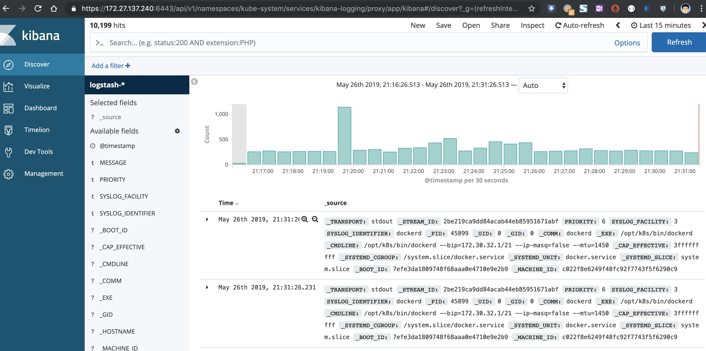

<!-- toc -->

tags: EFK, fluentd, elasticsearch, kibana

# 部署 EFK 插件

官方文件目录：`kubernetes/cluster/addons/fluentd-elasticsearch`

``` bash
$ ls *.yaml
es-service.yaml  es-statefulset.yaml  fluentd-es-configmap.yaml  fluentd-es-ds.yaml  kibana-deployment.yaml  kibana-service.yaml
```

已经修改好的 yaml 文件见：[EFK](https://github.com/opsnull/follow-me-install-kubernetes-cluster/blob/master/manifests/EFK)。

## 配置 es-controller.yaml

``` bash

$ cp es-statefulset.yaml{,.bak}
$ diff es-statefulset.yaml{,.bak}
76c76
<       - image: longtds/elasticsearch:v5.6.4
---
>       - image: k8s.gcr.io/elasticsearch:v5.6.4


$ cp fluentd-es-ds.yaml{,.bak}
$ vim fluentd-es-ds.yaml
$ diff fluentd-es-ds.yaml{,.bak}
79c79
<         image: netonline/fluentd-elasticsearch:v2.0.4
---
>         image: k8s.gcr.io/fluentd-elasticsearch:v2.0.4
```

## 给 Node 设置标签

DaemonSet `fluentd-es-v1.22` 只会调度到设置了标签 `beta.kubernetes.io/fluentd-ds-ready=true` 的 Node，需要在期望运行 fluentd 的 Node 上设置该标签；

``` bash
$ kubectl get nodes
NAME        STATUS    AGE       VERSION
kube-node1   Ready     <none>    1d        v1.10.2

$ kubectl label nodes kube-node1 beta.kubernetes.io/fluentd-ds-ready=true
node "kube-node1" labeled
```

## 执行定义文件

``` bash
$ pwd
/vagrant/kubernetes/cluster/addons/fluentd-elasticsearch
$ ls *.yaml
es-service.yaml  es-statefulset.yaml  fluentd-es-configmap.yaml  fluentd-es-ds.yaml  kibana-deployment.yaml  kibana-service.yaml
$ kubectl create -f .
$
```

## 检查执行结果

``` bash
$ kubectl get deployment -n kube-system|grep kibana
kibana-logging         1         1         1            0           1m

$ kubectl get pods -n kube-system|grep -E 'elasticsearch|fluentd|kibana'
elasticsearch-logging-0                 0/1       CrashLoopBackOff   18         8h
elasticsearch-logging-1                 0/1       CrashLoopBackOff   18         5h
fluentd-es-v2.0.4-f9kp8                 1/1       Running            0          8h
kibana-logging-7445dc9757-c6wc7         1/1       Running            14         8h

$ kubectl get service  -n kube-system|grep -E 'elasticsearch|kibana'
elasticsearch-logging   ClusterIP   10.254.129.206   <none>        9200/TCP        8h
kibana-logging          ClusterIP   10.254.79.80     <none>        5601/TCP        8h
```

kibana Pod 第一次启动时会用**较长时间(10-20分钟)**来优化和 Cache 状态页面，可以 tailf 该 Pod 的日志观察进度：

``` bash
$ kubectl logs kibana-logging-7445dc9757-c6wc7 -n kube-system -f
ELASTICSEARCH_URL=http://elasticsearch-logging:9200
server.basePath: /api/v1/proxy/namespaces/kube-system/services/kibana-logging
{"type":"log","@timestamp":"2017-04-08T09:30:30Z","tags":["info","optimize"],"pid":7,"message":"Optimizing and caching bundles for kibana and statusPage. This may take a few minutes"}
{"type":"log","@timestamp":"2017-04-08T09:44:01Z","tags":["info","optimize"],"pid":7,"message":"Optimization of bundles for kibana and statusPage complete in 811.00 seconds"}
{"type":"log","@timestamp":"2017-04-08T09:44:02Z","tags":["status","plugin:kibana@1.0.0","info"],"pid":7,"state":"green","message":"Status changed from uninitialized to green - Ready","prevState":"uninitialized","prevMsg":"uninitialized"}
```

## 访问 kibana

1. 通过 kube-apiserver 访问：

    获取 monitoring-grafana 服务 URL

    ``` bash
    $ kubectl cluster-info
    Kubernetes master is running at https://10.64.3.1:6443
    CoreDNS is running at https://10.64.3.1:6443/api/v1/namespaces/kube-system/services/coredns:dns/proxy
    Elasticsearch is running at https://10.64.3.1:6443/api/v1/namespaces/kube-system/services/elasticsearch-logging/proxy
    Heapster is running at https://10.64.3.1:6443/api/v1/namespaces/kube-system/services/heapster/proxy
    Kibana is running at https://10.64.3.1:6443/api/v1/namespaces/kube-system/services/kibana-logging/proxy
    kubernetes-dashboard is running at https://10.64.3.1:6443/api/v1/namespaces/kube-system/services/https:kubernetes-dashboard:/proxy
    monitoring-grafana is running at https://10.64.3.1:6443/api/v1/namespaces/kube-system/services/monitoring-grafana/proxy
    monitoring-influxdb is running at https://10.64.3.1:6443/api/v1/namespaces/kube-system/services/monitoring-influxdb/proxy
    ```

    由于 kube-apiserver 开启了 RBAC 授权，而浏览器访问 kube-apiserver 的时候使用的是匿名证书，所以访问安全端口会导致授权失败。这里需要使用**非安全**端口访问 kube-apiserver：

    浏览器访问 URL： `http://10.64.3.1:8080/api/v1/namespaces/kube-system/services/kibana-logging/proxy`
    对于 virtuabox 做了端口映射： `http://127.0.0.1:8080/api/v1/namespaces/kube-system/services/kibana-logging/proxy`

1. 通过 kubectl proxy 访问：

    创建代理

    ``` bash
    $ kubectl proxy --address='10.64.3.1' --port=8086 --accept-hosts='^*$'
    Starting to serve on 10.64.3.1:8086
    ```

    浏览器访问 URL：`http://10.64.3.1:8086/api/v1/namespaces/kube-system/services/kibana-logging/proxy`
    对于 virtuabox 做了端口映射： `http://127.0.0.1:8086/api/v1/namespaces/kube-system/services/kibana-logging/proxy`

在 Settings -> Indices 页面创建一个 index（相当于 mysql 中的一个 database），选中 `Index contains time-based events`，使用默认的 `logstash-*` pattern，点击 `Create` ;


创建Index后，稍等几分钟就可以在 `Discover` 菜单下看到 ElasticSearch logging 中汇聚的日志；

