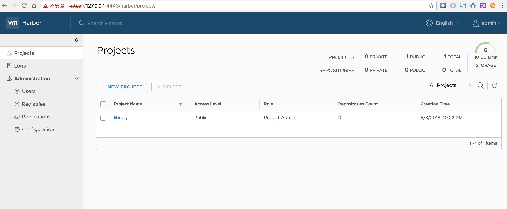

# 部署 harbor 私有仓库

本文档介绍使用 docker-compose 运行 harbor 私有仓库的步骤，你也可以使用 docker 官方的 registry 镜像部署私有仓库([部署 Docker Registry](12-部署Docker-Registry.md))。

## 使用的变量

本文档用到的变量定义如下：

``` bash
$ export NODE_IP=10.64.3.7 # 当前部署 harbor 的节点 IP
$
```

## 下载文件

从 docker compose [发布页面](https://github.com/docker/compose/releases)下载最新的 `docker-compose` 二进制文件

``` bash
$ wget https://github.com/docker/compose/releases/download/1.12.0/docker-compose-Linux-x86_64
$ mv ~/docker-compose-Linux-x86_64 /root/local/bin/docker-compose
$ chmod a+x  /root/local/bin/docker-compose
$ export PATH=/root/local/bin:$PATH
$
```

从 harbor [发布页面](https://github.com/vmware/harbor/releases)下载最新的 harbor 离线安装包

``` bash
$ wget  --continue https://github.com/vmware/harbor/releases/download/v1.1.0/harbor-offline-installer-v1.1.0.tgz
$ tar -xzvf harbor-offline-installer-v1.1.0.tgz
$ cd harbor
$
```

## 导入 docker images

导入离线安装包中 harbor 相关的 docker images

``` bash
$ docker load -i harbor.v1.1.0.tar.gz
$
```

## 创建 harbor nginx 服务器使用的 TLS 证书

创建 harbor 证书签名请求：

``` bash
$ cat > harbor-csr.json <<EOF
{
  "CN": "harbor",
  "hosts": [
    "127.0.0.1",
    "$NODE_IP"
  ],
  "key": {
    "algo": "rsa",
    "size": 2048
  },
  "names": [
    {
      "C": "CN",
      "ST": "BeiJing",
      "L": "BeiJing",
      "O": "k8s",
      "OU": "System"
    }
  ]
}
EOF
```

+ hosts 字段指定授权使用该证书的当前部署节点 IP，如果后续使用域名访问 harbor，则还需要添加域名；

生成 harbor 证书和私钥：

``` bash
$ cfssl gencert -ca=/etc/kubernetes/ssl/ca.pem \
  -ca-key=/etc/kubernetes/ssl/ca-key.pem \
  -config=/etc/kubernetes/ssl/ca-config.json \
  -profile=kubernetes harbor-csr.json | cfssljson -bare harbor
$ ls harbor*
harbor.csr  harbor-csr.json  harbor-key.pem harbor.pem
$ sudo mkdir -p /etc/harbor/ssl
$ sudo mv harbor*.pem /etc/harbor/ssl
$ rm harbor.csr  harbor-csr.json
```

## 修改 harbor.cfg 文件

``` bash
$ diff harbor.cfg.orig harbor.cfg
5c5
< hostname = reg.mydomain.com
---
> hostname = 10.64.3.7
9c9
< ui_url_protocol = http
---
> ui_url_protocol = https
24,25c24,25
< ssl_cert = /data/cert/server.crt
< ssl_cert_key = /data/cert/server.key
---
> ssl_cert = /etc/harbor/ssl/harbor.pem
> ssl_cert_key = /etc/harbor/ssl/harbor-key.pem
```

## 创建和启动 harbor 镜像

``` bash
$ ./install.sh
[Step 0]: checking installation environment ...

Note: docker version: 17.04.0

Note: docker-compose version: 1.12.0

[Step 1]: loading Harbor images ...
Loaded image: vmware/harbor-adminserver:v1.1.0
Loaded image: vmware/harbor-ui:v1.1.0
Loaded image: vmware/harbor-log:v1.1.0
Loaded image: vmware/harbor-jobservice:v1.1.0
Loaded image: vmware/registry:photon-2.6.0
Loaded image: vmware/harbor-notary-db:mariadb-10.1.10
Loaded image: vmware/harbor-db:v1.1.0
Loaded image: vmware/nginx:1.11.5-patched
Loaded image: photon:1.0
Loaded image: vmware/notary-photon:server-0.5.0
Loaded image: vmware/notary-photon:signer-0.5.0


[Step 2]: preparing environment ...
Generated and saved secret to file: /data/secretkey
Generated configuration file: ./common/config/nginx/nginx.conf
Generated configuration file: ./common/config/adminserver/env
Generated configuration file: ./common/config/ui/env
Generated configuration file: ./common/config/registry/config.yml
Generated configuration file: ./common/config/db/env
Generated configuration file: ./common/config/jobservice/env
Generated configuration file: ./common/config/jobservice/app.conf
Generated configuration file: ./common/config/ui/app.conf
Generated certificate, key file: ./common/config/ui/private_key.pem, cert file: ./common/config/registry/root.crt
The configuration files are ready, please use docker-compose to start the service.


[Step 3]: checking existing instance of Harbor ...


[Step 4]: starting Harbor ...
Creating network "harbor_harbor" with the default driver
Creating harbor-log
Creating registry
Creating harbor-adminserver
Creating harbor-db
Creating harbor-ui
Creating harbor-jobservice
Creating nginx

✔ ----Harbor has been installed and started successfully.----

Now you should be able to visit the admin portal at https://10.64.3.7.
For more details, please visit https://github.com/vmware/harbor .
```

## 访问管理界面

浏览器访问 `https://${NODE_IP}`，示例的是 `https://10.64.3.7`

用账号 `admin` 和 harbor.cfg 配置文件中的默认密码 `Harbor12345` 登陆系统：



## harbor 运行时产生的文件、目录

``` bash
$ # 日志目录
$ ls /var/log/harbor/2017-04-19/
adminserver.log  jobservice.log  mysql.log  proxy.log  registry.log  ui.log
$ # 数据目录，包括数据库、镜像仓库
$ ls /data/
ca_download  config  database  job_logs registry  secretkey
```

## docker 客户端登陆

``` bash
$ docker login 10.64.3.7
Username: admin
Password:
```

认证信息自动保存到 `~/.docker/config.json` 文件。

## 其它操作

下列操作的工作目录均为 解压离线安装文件后 生成的 harbor 目录。

``` bash
$ # 停止 harbor
$ docker-compose down -v
$ # 修改配置
$ vim harbor.cfg
$ # 更修改的配置更新到 docker-compose.yml 文件
[root@tjwq01-sys-bs003007 harbor]# ./prepare
Clearing the configuration file: ./common/config/ui/app.conf
Clearing the configuration file: ./common/config/ui/env
Clearing the configuration file: ./common/config/ui/private_key.pem
Clearing the configuration file: ./common/config/db/env
Clearing the configuration file: ./common/config/registry/root.crt
Clearing the configuration file: ./common/config/registry/config.yml
Clearing the configuration file: ./common/config/jobservice/app.conf
Clearing the configuration file: ./common/config/jobservice/env
Clearing the configuration file: ./common/config/nginx/cert/admin.pem
Clearing the configuration file: ./common/config/nginx/cert/admin-key.pem
Clearing the configuration file: ./common/config/nginx/nginx.conf
Clearing the configuration file: ./common/config/adminserver/env
loaded secret from file: /data/secretkey
Generated configuration file: ./common/config/nginx/nginx.conf
Generated configuration file: ./common/config/adminserver/env
Generated configuration file: ./common/config/ui/env
Generated configuration file: ./common/config/registry/config.yml
Generated configuration file: ./common/config/db/env
Generated configuration file: ./common/config/jobservice/env
Generated configuration file: ./common/config/jobservice/app.conf
Generated configuration file: ./common/config/ui/app.conf
Generated certificate, key file: ./common/config/ui/private_key.pem, cert file: ./common/config/registry/root.crt
The configuration files are ready, please use docker-compose to start the service.
$ # 启动 harbor
[root@tjwq01-sys-bs003007 harbor]# docker-compose up -d
```