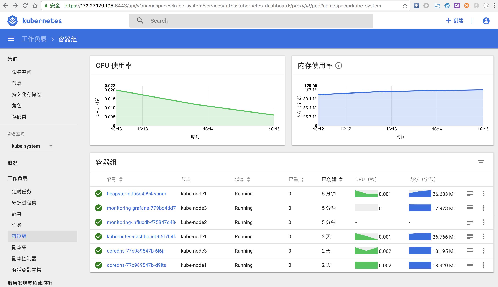

# 和我一步步部署 kubernetes 集群

本系列文档介绍使用二进制部署 `kubernetes` 集群的所有步骤，而不是使用 `kubeadm` 等自动化方式来部署集群；

在部署的过程中，将详细列出各组件的启动参数，它们的含义和可能遇到的问题。

部署完成后，你将理解系统各组件的交互原理，进而能快速解决实际问题。

所以本文档主要适合于那些有一定 kubernetes 基础，想通过一步步部署的方式来学习和了解系统配置、运行原理的人。

## 集群详情

+ Kubernetes 1.6.1
+ Docker  17.04.0-ce
+ Etcd 3.1.5
+ Flanneld 0.7 vxlan 网络
+ TLS 认证通信 (所有组件，如 etcd、kubernetes master 和 node)
+ RBAC 授权
+ kublet TLS BootStrapping
+ kubedns、dashboard、heapster (influxdb、grafana)、EFK (elasticsearch、fluentd、kibana) 插件
+ 私有 docker registry，使用 ceph rgw 后端存储，TLS + HTTP Basic 认证

## 步骤介绍

1. [创建 TLS 证书和秘钥](01-ca-tls.md)
1. [下载和配置 Kubectl 命令行工具](02-kubectl.md)
1. [部署高可用 Etcd 集群](03-ha-etcd-cluster.md)
1. [部署 Master 节点](04-master.md)
1. [配置 Node Kubeconfig 文件](05-kubeconfig.md)
1. [部署 Node 节点](06-node.md)
1. [部署 DNS 插件](07-dns-addon.md)
1. [部署 Dashboard 插件](08-dashboard-addon.md)
1. [部署 Heapster 插件](09-heapster-addon.md)
1. [部署 EFK 插件](10-efk-addons.md)
1. [部署 Docker Registry](11-docker-registry.md)
1. [清理集群](12-clean-cluster.md)

## 注意

1. 由于启用了 TLS 双向认证、RBAC 授权等严格的安全机制，建议**从头开始部署**，而不要从中间开始，否则可能会认证、授权等失败！
1. 本文档将**随着各组件的更新而更新**，有任何问题欢迎提 issue！

## 版权

Copyright 2017 zhangjun(geekard@qq.com)

Apache License 2.0，详情见 [LICENSE](LICENSE) 文件。

希望对你有帮助！